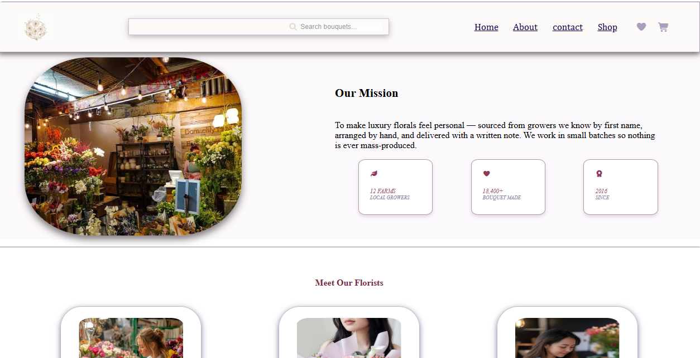
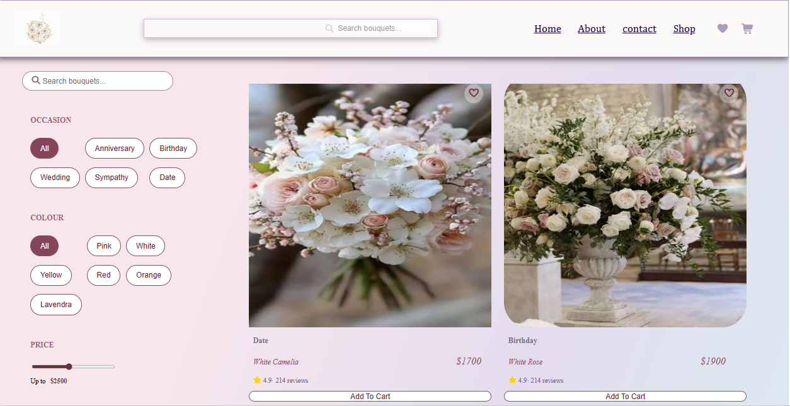
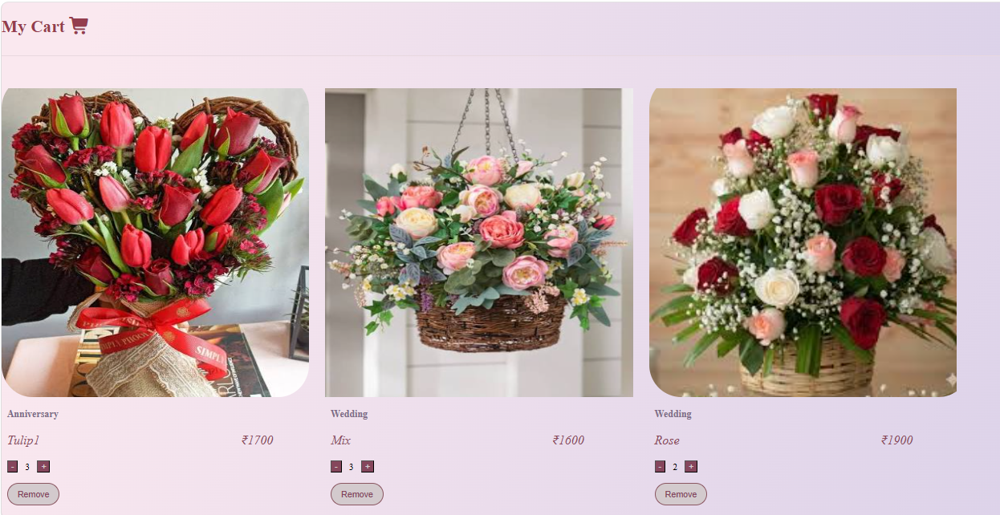
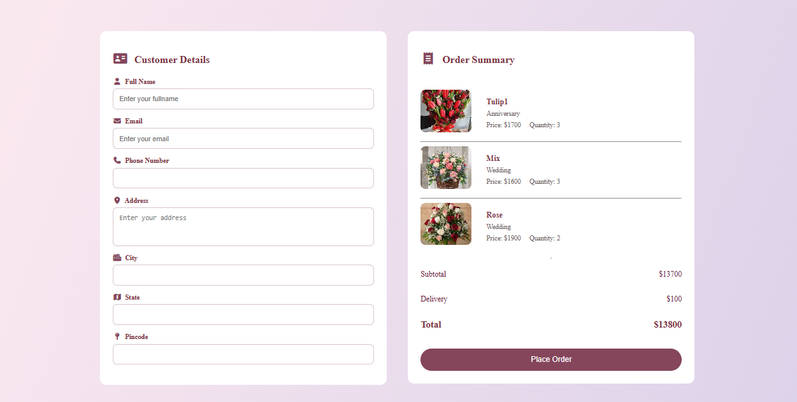
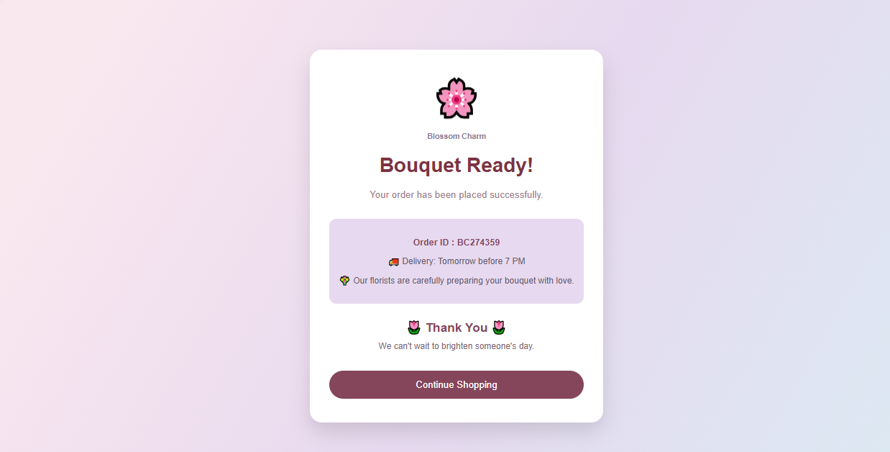

Floerella – Flower Shop Website
Floerella is a modern, responsive flower shop website built using HTML, CSS, and JavaScript. The project provides a complete front-end shopping experience with a clean, elegant design and interactive features. It demonstrates responsive web design, DOM manipulation, LocalStorage, and user-friendly UI/UX principles.

✨ Features
🌼 Responsive Design (Desktop, Tablet & Mobile)
🔍 Product Search
🎯 Filter by Occasion
🎨 Filter by Flower Color
💰 Price Filter
❤️ Wishlist
🛒 Shopping Cart
➕ Increase/Decrease Quantity
🗑 Remove Items from Cart
💳 Checkout Page
🎉 Order Success Page
💾 LocalStorage Support
🌸 20 Beautiful Flower Products
🛠 Technologies Used
HTML5
CSS3
JavaScript (ES6)
LocalStorage
Font Awesome
📂 Project Structure
Floerella/
│
├── index.html
├── pages/
├── css/
├── js/
├── images/
└── README.md
📱 Responsive
The website is fully responsive and optimized for:

💻 Desktop
📱 Mobile
📟 Tablet
🚀 How to Run
Clone the repository
git clone https://github.com/Anchalcloud/Floerella.git
Open the project folder.

Run index.html using Live Server or any web browser.

## 📸 Screenshots

### 🏠 Home Page
Elegant landing page with featured bouquets, search functionality, and category shortcuts.

---

### 🌿 About Page
Learn about Floerella's mission, values, and dedicated florists.

---

### 🌸 Shop Page
Browse bouquets using occasion, color, and price filters.

---

### 🛒 Shopping Cart
Manage quantities, remove items, and review your order before checkout.

---

### 💳 Checkout
Enter customer details and review your order before placing it.

---

### 🎉 Order Successful
Confirmation page displayed after successfully placing an order.

---

🎯 Future Improvements
User Authentication
Backend Integration (Node.js & Express)
MongoDB Database
Online Payment Gateway
Admin Dashboard
Order Tracking
👩‍💻 Author
Anchal

Aspiring AI Engineer & Full Stack Developer

📄 License
This project is created for learning and portfolio purposes.